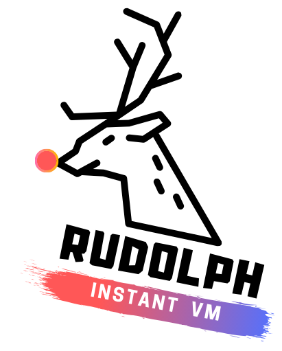

# Rudolph

<b>Rudolph</b> a is CLI application for creating EC2 like environments for deploying and testing your projects. It is pre-baked with CI/CD support and runs on Kubernetes and docker by default. So, basically all you need is you need is a your project folder and a working installation of the Docker platform. 

 Moreover, it comes with it's own web based terminal which you can access from your browser using the container id. It also comes with a built-in command-line support and does not require any external dependencies. 

 This tool is extremely useful for testing your application in a separate environment having your own preferred OS distribution along with the relevant list of dependencies. Once, you're happy with the way how it works, you can easily deploy the container anywhere without much hassle.

## Basic instructions :

    --create            will setup an environment to get you started
                        requires size of vm.
                        requires number of cpu to be allocated
                        requires which port to open.

    --purge             it will completely remove vm's which are not
                        working or stalled.

    --delete [VM ID]    it will remove all the data including the vm
                        from system hardware.

    --performance [VM]  shows system utility of vm (can be used while
                        testing load or scaling.)

## Options for Operating Systems in the container

- Ubuntu 14.04 
- Ubuntu 16.04
- Ubuntu 18.04
- Ubuntu 19.04
- centOS 6.10
- centOS 7
- Debian Jessie
- Debian Stretch

## Options for frameworks

- Spring-boot
- Flask-App
- Django

## TODO
    - allow custom jenkins pipeline 
    - support dynamic ip change
    - create and support load testing env
    - Streaming server and FTP server

## CONTACT 
    mail ( sarkar.anurag@outlook.com )
    mail ( anishksaha1997@gmail.com )
